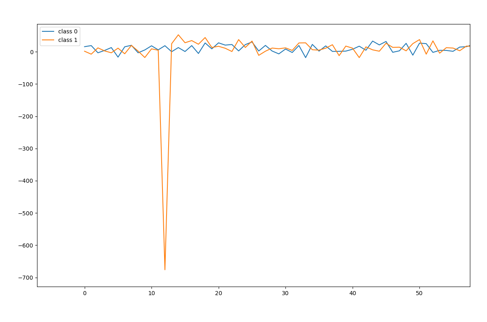
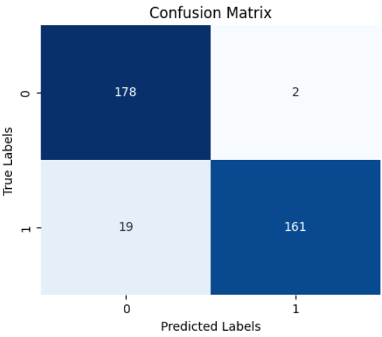

## Hardware Fingerprinting based on Electric Noise
This repository presents a unique approach to identifying embedded devices using intrinsic electrical noise extracted from signals. We demonstrate that even identical Arduino Uno boards produce distinguishable noise patterns due to manufacturing imperfections.

📄 **Published Work**:  
TITLE: [Hardware Embedded Fingerprinting Based on Electric Noise – ACIT 2025](https://ieeexplore.ieee.org/document/10877015)  
DOI: [10.1109/ACIT62805.2024.108770155]

---
## Project Summary
- Two Arduino Uno boards generate 980Hz PWM signals.
- PicoScope captures the signals at 1 MS/s, 16-bit resolution.
- Custom MATLAB scripts extract the low-voltage segment noise (<100mV).
- A labeled time-series dataset is formed for CNN training.
- A 5-layer 1D CNN is trained using Keras (Python) to distinguish devices.
- Achieved 94% Accuracy.

---

## 📈 Signal Visualization (Device Fingerprints)

Below are raw noise waveform segments captured from two Arduino Uno boards of the same make, model, and running identical firmware. Even though both devices run the same firmware and hardware, their intrinsic electrical noise patterns are measurably different due to manufacturing variations.

### Short Segment (zoomed view)



### Long Segment (full window)


The plots show time-domain noise waveforms:
- X-axis: time progression (sampled at 1 MS/s)
- Y-axis: measured voltage amplitude

### Observations

- Each board exhibits unique transient spikes and noise bursts
- Amplitude fluctuations differ across devices
- Noise statistics and temporal structure are not identical
- These differences form a hardware "fingerprint"

The CNN model learns these subtle time-domain characteristics to reliably distinguish between devices.

---
## Results
- **Test Samples**: 360  
- **Accuracy**: 94%  
- **Confusion Matrix**:
  - Arduino 1: 178/180 correct
  - Arduino 2: 161/180 correct

### Confusion Matrix



---
## Acknowledgments
This implementation builds upon:

- Time series classification from scratch: (https://ieeexplore.ieee.org/document/7966039)
- Keras Example: (https://github.com/keras-team/keras-io/blob/master/examples/timeseries/timeseries_classification_from_scratch.py)

---
## Citation
```bibtex
@INPROCEEDINGS{10877015,
  author={Shaout, Adnan and Hasan, Arif and Shravan, Murlidharan},
  booktitle={2024 25th International Arab Conference on Information Technology (ACIT)}, 
  title={Hardware Embedded Fingerprinting Based on Electric Noise}, 
  year={2024},
  volume={},
  number={},
  pages={1-7},
  keywords={Performance evaluation;Embedded systems;Noise;Printed circuits;Artificial neural networks;Fingerprint recognition;Pulse width modulation;Security;Object recognition;Integrated circuit modeling;embedded device fingerprint (EDFP);noise;PWM signal;counterfeit embedded device},
  doi={10.1109/ACIT62805.2024.10877015}}
```

---
## License
This work is provided under an open license for academic and non-commercial use, with credit to original sources as acknowledged above.